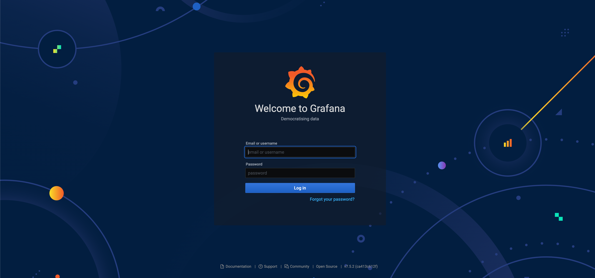
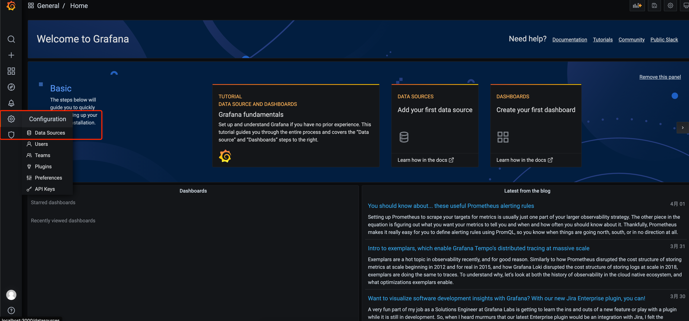
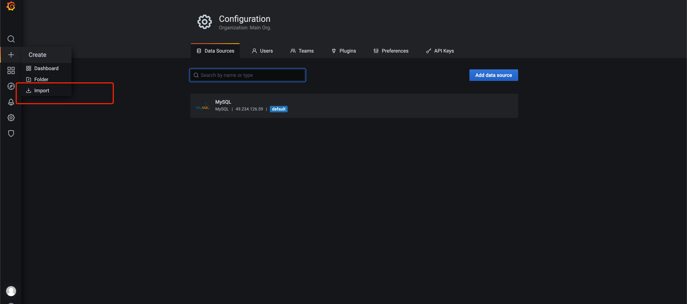
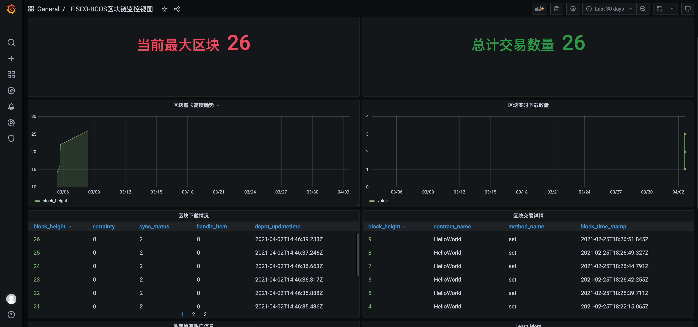

# Data-Export docker启动

## 前置依赖

| 依赖软件 | 说明 |备注|
| --- | --- | --- |
| FISCO-BCOS | 2.0及以上版本 | |
| MySQL | >= mysql-community-server[5.7] | |


## 获取启动脚本和配置文件

```
curl -#LO https://github.com/WeBankBlockchain/Data-Export-Demo/releases/download/1.7.2-beta/data-export-1.7.2-beta.tar.gz
```

解压文件包至当前目录
```
tar -zxvf data-export-1.7.2-beta.tar.gz && cd data-export && chmod -x build_export.sh
```

data-export目录如下：
```
├── data-export
│   ├── config
│   │   ├── application.properties
│   ├── log
│   └── build_export.sh
```
config为配置文件目录，使用channel方式连接区块链时，需将证书放至该目录。
log为运行日志保存的地方。


## 配置证书（channel方式启动）

将链节点SDK证书拷贝到 **./data-export/config**下，SDK证书目录位于nodes/${ip}/sdk/目录下
```
# 假设SDK证书位于~/fisco/nodes/127.0.0.1/sdk/目录
cp -r ~/fisco/nodes/127.0.0.1/sdk/* ./data-export/config/
```


## 配置文件

配置文件application.properties位于config目录下，进入config

```
cd config
```

修改application.properties文件：该文件包含了所有的配置信息。以下配置信息是必须要修改的：

```
### The following types are supported:
### 1, Channel
### 2, JsonRPC
### 3, Data-Stash
### 选择上述三种中一种方式配置即可，推荐 Channel方式

# 1、Channel方式启动，需配置证书
## GROUP_ID必须与FISCO-BCOS中配置的groupId一致。
system.groupId=1
# 节点的IP及通讯端口、组号。 
##IP为节点运行的IP，PORT为节点运行的channel_port，默认为20200
system.nodeStr=[IP]:[PORT]
system.certPath=./config

# 2、RPC方式启动
#system.groupId=1
#system.cryptoTypeConfig=0
#system.rpcUrl=

# 3、数据仓库方式启动
#system.jdbcUrl=jdbc:mysql://[ip]:[port]/[db]?autoReconnect=true&useSSL=false&serverTimezone=Asia/Shanghai&useUnicode=true&characterEncoding=UTF-8
#system.user=
#system.password=
#system.cryptoTypeConfig=0

### 数据库的信息，暂时只支持mysql； serverTimezone 用来设置时区
### 请确保在运行前创建对应的database，如果分库分表，则可配置多个数据源，如system.db1.dbUrl=\system.db1.user=\system.db0.password=
system.db0.dbUrl=jdbc:mysql://[ip]:[port]/[db]?autoReconnect=true&useSSL=false&serverTimezone=Asia/Shanghai&useUnicode=true&characterEncoding=UTF-8
system.db0.user=
system.db0.password=

### 是否自动建表，默认开启
system.db.autoCreateTable=true

### 合约信息，导出交易详情、方法、事件等数据时需配置，不配置则只导出基础数据
### 可配置多合约，格式：system.contract+numer.contractName, 其中number递增排列
system.contract0.contractName=
system.contract0.abi=
system.contract0.binary=
```


## 可视化安装配置

在application.properties中将grafana打开时，将在docker中自动部署grafana，通过[ip]:3000即可访问，配置如下:
```
system.grafanaEnable=true
```

## 更多配置

更多配置参见application.properties文件，还包括ES存储、多活、分库分表等多种配置，可按需配置。

## 启动脚本

```
bash build_export.sh
```
上述脚本会自动安装docker，并拉取对应镜像，进行执行。如果docker安装失败，请手动安装后重新执行脚本。

控制台可看到提示启动结果：

```
......
docker.io/wangyue168git/dataexport:1.7.2
b7c087943edbe731304c76bcc44d705d20a8362fa8f2271d0d03ca6c75ee061c
data export run success
See the logging command: docker logs -f dataexport
.....

```

如果打开了grafana，则可看到执行提示如下：
```
docker.io/grafana/grafana:latest
c9cc7e8920c17d0f5421808b058a2f39e827234c0b781f393b8e60ef8d073d86
grafana run success
```


通过如下命令可查看运行日志：
```
docker logs -f dataexport
```

## 修改配置

停止运行，命令如下
```
docker stop dataexport
```

修改application.properties配置文件后，重新启动，命令如下

```
docker restart dataexport
```

## 可视化展示配置

在application.properties中将grafana打开时，系统将会生成可视化json脚本 default_dashboard.json 文件，位于config目录下。

grafana安装并启动成功，通过访问[ip]:3000（本机则为localhost:3000）即可看到如下界面：
<br /> <br />

<br /> <br />

输入账密admin/admin, 现在跳过即可进入主界面，添加导出数据库的mysql信息，如下位置：
<br /> <br />

<br /> <br />

添加mysql成功后，可通过如下方式导入系统生成的default_dashboard.json文件，如下位置：
<br /> <br />

<br /> <br />

导入成功后即可看到链的数据可视化情况，如下：
<br /> <br />

<br /> <br />

## 问题

### docker与数据库或链在一台机器上，docker无法访问宿主机

如果链或者数据库为本地安装，需查询本机ip，替换上述配置中的localhost 或者 127.0.0.1 地址。

启动脚本中已对本地ip进行了查询并替换，如果失败，可以按照下列命令查询并手动替换。

查询ip命令为：

```
   ifconfig | grep "inet " | grep -v 127.0.0.1
```

其中inet后的ip地址，即为本机ip


### centos启动脚本报yum更新失败

错误如：
```
yum更新失败：rpmdb: BDB0113 Thread/process 2673/140126198814528 failed: BDB1507 Thread died...
```
解决方式如下：
```
# cd /var/lib/rpm
# ls
Basenames     __db.001  __db.003  Group       Name          Packages     Requirename  Sigmd5
Conflictname  __db.002  Dirnames  Installtid  Obsoletename  Providename  Sha1header   Triggername
# rm -rf __db*
# rpm --rebuilddb
```
